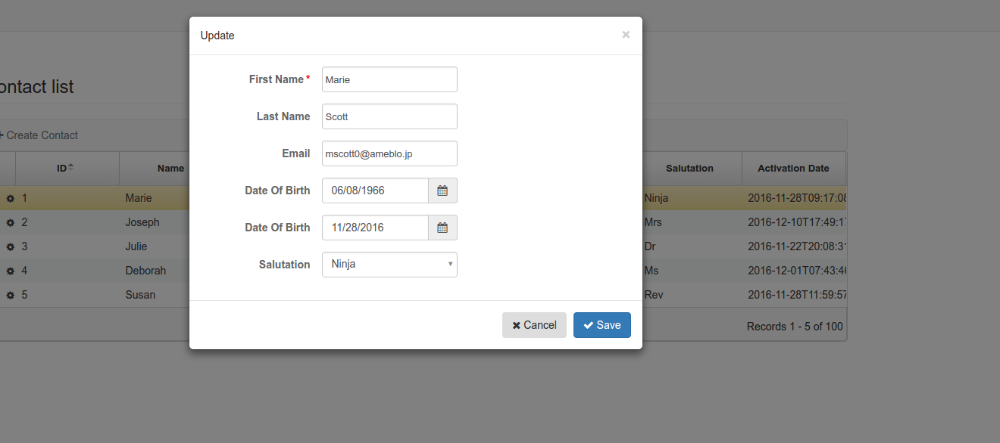

= Creating Grails applications using Angle-Grinder's Angular and restful DAO services
:hide-uri-scheme:
:toc:
:numbered:
:icons: font
//common link variables
:docs-HttpStatus: http://docs.spring.io/spring/docs/current/javadoc-api/org/springframework/http/HttpStatus.html
:docs-grails: http://docs.grails.org/latest/guide
:docs-grails-ws: http://docs.grails.org/latest/guide/webServices.html
:src-grails-rest: https://github.com/grails/grails-core/blob/master/grails-plugin-rest
:url-snapshot5: https://github.com/9ci/angle-grinder/blob/rest_tutorial/grails/restTutorial/snapshot5

== Getting started

For this tutorial you will need icon:twitter[]

* JDK (I advise 8, but you can take 7 as well).

* Git.

* Grails 3.2.0 (you can install it with http://sdkman.io on most Unix based systems.)

After all is installed clone the repo:

----
git clone https://github.com/9ci/angle-grinder
----

and switch to branch `rest_tutorial` branch, and go to `angle-grinder/grails/restTutorial/step1`, the final result is in
the `result` folder for each step

So first let's create new grails app:

----
$ grails create-app -profile rest-api -features hibernate4 resttutorail
Application created at angle-grinder/grails/restTutorial/snapshot1
----

Grails 3 provides several different profiles you can read about them in the {docs-grails}/profiles.html[docs]

== Creating an API with Grails Web Services

As described in the {docs-grails-ws}[Grails web service docs]
we will use the default out of the box functionality as a starting point.

=== Creating a GORM domain

----
grails create-domain-class Contact
----

Then set it up like so:

[source,groovy]
----
class Contact {
  String firstName
  String lastName
  String email
  Boolean inactive

  static constraints = {
    firstName nullable: false
    inactive bindable:false
  }
}
----

To avoid writing `nullable: true` we will set the default to allow nulls for fields
Add the following to `grails-app/config/application.groovy`

[source,groovy]
----
grails.gorm.default.constraints = {
  '*' (nullable: true, blank: true)
}
----

We will load 100 rows of mock test data from a file `Contacts.json` in resources.
The mock data was generated from a great tool https://www.mockaroo.com[Mockaroo]. Check it out

[source,groovy]
----
class BootStrap {
    def grailsApplication
    def init = { servletContext ->
        def data = new JsonSlurper().parse(new File("../resources/Contacts.json"))
        data.each{
          Contact contact = new Contact(it)
          contact.save(failOnError:true,flush: true)
        }
    }
    def destroy = {
    }
}
----

==== Adding the `@Resource` annotation to our domain
:url-dr: {docs-grails}#domainResources

So now we can start working on creating REST Api for our app.
The easiest way is to use {url-dr}[domain resources].
So as we see from {url-dr}[docs] we just need to update our domain a bit (just add `@Resource` anotation) in such a way:

[source,groovy]
----
@Resource(uri = '/contact', formats = ["json"])
class Contact {
  ...
}
----

[NOTE]
.On plural resource names
====
As you will notice we did not pluralize it to contacts above as many will do.
We are aware of the debate on this in the rest world. We feel this will cause confusion down the line to do it.

1. English plural rules like "cherry/cherries" or "goose/geese/moose/meese" are not the nicest thing to think of while developing API, particularly when english is not your mother tongue.
2. Many times, as in Grails, we want to generate endpoint from the model, which is usually singular. It does not play nicely with the above pluralization exceptions and creates more work maintaining UrlMappings.
3. When the model is singular, which is normally is for us, keeping the rest endpoint singular will have the rest developers and the grails developers speaking the same language
3. The argument "usually you start querying by a Get to display a list" does not refer to any real use case. And we will end up querying single items as much as and even more than a list of items.
====


===== The `RestfullController`

.@Resource creates a RestfullController for the domain
NOTE: The `@Resource` annotation is used in an ASTTransformation that creates a controller that extends RestfullController.
See {src-grails-rest}/src/main/groovy/org/grails/plugins/web/rest/transform/ResourceTransform.groovy[ResourceTransform]
for details on how it does this. Later we will show how to specify the controller to user with superClass property.

=== Default Endpoints and Status Codes

==== Url Mappings

The section on {docs-grails}#extendingRestfulController[Extending Restful Controllers]
outlines the action names and the URIs they map to:

.URI, Controller Action and Response Defaults
[cols="2,1,1,3", format="csv", options="header", width="80",grid=rows]
|===
URI, Method, Action, Response Data
/contact , GET , index , Paged List
/contact/create, GET , create , Contact.newInstance() unsaved
/contact, POST , save , The successfully saved contact (same as show's get)
/contact/${id}, GET , show , The contact for the id
/contact/${id}/edit, GET , edit , The contact for the id. same as show
/contact/${id}, PUT , update , The successfully updated contact
/contact/${id}, DELETE , delete , Empty response with HTTP status code 204
|===

==== Status Code Defaults

Piecing together the {javadoc-HttpStatus}[HttpStatus codes] and results from RestfullController, RestResponder and _errors.gson,
these are what looks like the out of the box status codes as of Grails 3.2.2

.Status Codes Out Of Box
[options="header", cols="1,2", grid=rows]
|===
| Status Code               | Description
| 200 - OK                  | Everything worked as expected. default
| 201 - CREATED             | Resource/instance was created. returned from `save` action
| 204 - NO_CONTENT          | response code on successful DELETE request
| 404 - NOT_FOUND           | The requested resource doesn't exist.
| 405 - METHOD_NOT_ALLOWED  | If method (GET,POST,etc..) is not setup in `static allowedMethods` for action or resource is read only
| 406 - NOT_ACCEPTABLE      | Accept header requests a response in an unsupported format. not configed in mime-types. RestResponder uses this
| 422 - UNPROCESSABLE_ENTITY | Validation errors.
|===


=== API Namespace

A Namespace is a mechanism to partition resources into a logically named group.

So the controllers that response for the REST endpoints we will move to separate namespace to avoid cases when we need to
have Controllers for GSP rendering or some other not related to REST stuff.

As a our preferred namespace design we will use the "api" namespace prefix for the rest of the tutorial.
So we will add ` namespace = '/api'` to change the uri on the contact @Resource

----
@Resource(uri = '/contact', namespace = '/api', formats = ["json"])
class Contact
----

Also we need to update UrlMappings.groovy, there are two ways:

1. Add `/api` prefix to each mapping for example  `get "/api/$controller(.$format)?"(action:"index")`
2. Use `group` property

We will use the second case:

.UrlMappings.groovy
[source,groovy]
----
package resttutorial

class UrlMappings {

    static mappings = {

      group("/api") {
        delete "/$controller/$id(.$format)?"(namespace:"api", action:"delete")
        get "/$controller(.$format)?"(action:"index")
        get "/$controller/$id(.$format)?"(action:"show")
        post "/$controller(.$format)?"(action:"save")
        put "/$controller/$id(.$format)?"(action:"update")
        patch "/$controller/$id(.$format)?"(action:"patch")
      }
        ...
    }
}
----

You can see all available endpoints that Grails create for us with url-mappings-report:

----
$ grails url-mappings-report
[options="header", cols="1,2", grid=rows]
|    *     | ERROR: 500                                | View:   /error           |
|    *     | ERROR: 404                                | View:   /notFound        |
|   GET    | /api/${controller}(.${format)?            | Action: index            |
|   POST   | /api/${controller}(.${format)?            | Action: save             |
|  DELETE  | /api/${controller}/${id}(.${format)?      | Action: delete           |
|   GET    | /api/${controller}/${id}(.${format)?      | Action: show             |
|   PUT    | /api/${controller}/${id}(.${format)?      | Action: update           |
|  PATCH   | /api/${controller}/${id}(.${format)?      | Action: patch            |

Controller: application
|    *     | /                                         | Action: index            |

Controller: contact
|   GET    | /contact/create                           | Action: create           |
|   GET    | /contact/${id}/edit                       | Action: edit             |
|   POST   | /contact                                  | Action: save             |
|   GET    | /contact                                  | Action: index            |
|  DELETE  | /contact/${id}                            | Action: delete           |
|  PATCH   | /contact/${id}                            | Action: patch            |
|   PUT    | /contact/${id}                            | Action: update           |
|   GET    | /contact/${id}                            | Action: show             |
----


=== Using CURL to test CRUD and List

Fire up the app with `run-app`

===== GET (list):
----
curl -i -X GET -H "Content-Type: application/json"  localhost:8080/contact
HTTP/1.1 200
X-Application-Context: application:development
Content-Type: application/json;charset=UTF-8
Transfer-Encoding: chunked
Date: Fri, 04 Nov 2016 14:48:14 GMT

[{"id":1,"email":"mscott0@ameblo.jp","firstName":"Marie","lastName":"Scott"},{"id":2,"email":"jrodriguez1@scribd.com" ...
----

===== POST:
----
curl -i -X POST -H "Content-Type: application/json" -d '{"firstName":"Joe", "lastName": "Cool"}' localhost:8080/contact
HTTP/1.1 201
X-Application-Context: application:development
Location: http://localhost:8080/contact/101
Content-Type: application/json;charset=UTF-8
Transfer-Encoding: chunked
Date: Fri, 04 Nov 2016 15:00:49 GMT

{"id":101,"firstName":"Joe","lastName":"Cool"}
----
===== GET (by id):
----
curl -i -X GET -H "Content-Type: application/json"  localhost:8080/contact/101
HTTP/1.1 200
X-Application-Context: application:development
Content-Type: application/json;charset=UTF-8
Transfer-Encoding: chunked
Date: Fri, 04 Nov 2016 15:02:09 GMT

{"id":101,"firstName":"Joe","lastName":"Cool"}
----

===== PUT:
----
curl -i -X PUT -H "Content-Type: application/json" -d '{"firstName": "New Name", "lastName": "New Last name"}' localhost:8080/contact/101
HTTP/1.1 200
X-Application-Context: application:development
Location: http://localhost:8080/contact/101
Content-Type: application/json;charset=UTF-8
Transfer-Encoding: chunked
Date: Fri, 04 Nov 2016 15:03:48 GMT

{"id":101,"firstName":"New Name","lastName":"New Last name"}
----

===== DELETE:
----
curl -i -X DELETE -H "Content-Type: application/json"  localhost:8080/contact/50
HTTP/1.1 204
X-Application-Context: application:development
Content-Type: application/json;charset=UTF-8
Date: Mon, 28 Nov 2016 07:43:11 GMT
----

===== 422 - Post Validation Error:
----
curl -i -X POST -H "Content-Type: application/json" -d '{"lastName": "Cool"}' localhost:8080/contact
HTTP/1.1 422
X-Application-Context: application:development
Content-Type: application/json;charset=UTF-8
Transfer-Encoding: chunked
Date: Mon, 28 Nov 2016 08:21:11 GMT

{"message":"Property [firstName] of class [class resttutorial.Contact] cannot be null","path":"","_links":{"self":{"href":"http://localhost:8080"}}}
----

===== 404 - Get Error:
----
curl -i -X GET -H "Content-Type: application/json"  localhost:8080/contact/105
HTTP/1.1 404
X-Application-Context: application:development
Content-Type: application/json;charset=UTF-8
Content-Language: en-US
Transfer-Encoding: chunked
Date: Mon, 28 Nov 2016 08:22:01 GMT

{"message":"Not Found","error":404}
----

===== 406 - NOT_ACCEPTABLE:

We did not setup XML support so we will get a 406. You may try adding XML to formats to see if this.
----
curl -i -X GET -H "Accept: application/xml"  http://localhost:8080/contact/8
HTTP/1.1 406
X-Application-Context: application:development
Content-Length: 0
Date: Mon, 28 Nov 2016 09:35:20 GMT
----

=== Functional Tests for the API

The next step is to add functional tests for our app. One option is to use Grails functional tests and RestBuilder.
We will cover another javscript option later the angle-grinder section
The line in the buidl.gradle that allows us to use RestBuilder is
----
testCompile "org.grails:grails-datastore-rest-client"
----

it is added by default when you create a grails app with `-profile rest-api`

==== POST testing example

Here is an example of `POST` request (creating of a new contact).
RestBuilder we use to emulate request from external source. Note, in Grails3 integration tests run on the random port,
so you cant call `http://localhost:8080/api/contact` , but we can use `serverPort` variable instead. And to make it more
intelligent lets use baseUrl. See example:

[source,groovy]
----
package resttutorial

import grails.plugins.rest.client.RestBuilder
import grails.plugins.rest.client.RestResponse
import grails.test.mixin.integration.Integration
import org.grails.web.json.JSONElement
import spock.lang.Shared
import spock.lang.Specification

@Integration
class ContactSpec extends Specification {

    @Shared
    RestBuilder rest = new RestBuilder()

    def getBaseUrl(){"http://localhost:${serverPort}/api"}

    void "check POST request"() {
        when:
        RestResponse response = rest.post("${baseUrl}/contact"){
          json([
            firstName: "Test contact",
            email:"foo@bar.com",
            inactive:true //is bindable: false - see domain, so it wont be set to contact
          ])
        }

        then:
        response.status == 201
        JSONElement json = response.json
        json.id == 101
        json.firstName == "Test contact"
        json.lastName == null
        json.email == "foo@bar.com"
        json.inactive == null
    }
}
----
:url-snapshot1: https://github.com/9ci/angle-grinder/blob/rest_tutorial/grails/restTutorial/snapshot1

More tests examples are in the are in the snapshot1 project's
{url-snapshot1}/src/integration-test/groovy/resttutorial/ContactSpec.groovy [ContactSpec.groovy]

=== GSON and Grails Views Defaults

As you can see by inspecting the views directory, by default Grails creates a number of gson files. Support for them is
provided with http://views.grails.org/latest/#_introduction[Grails Views Plugin]

The the obvious question how does it work. If you look at sources of the RestfullController it doesn't "call" this templates
explicitly. So under the hood plugin just looks on request, if url ends on `.json`(localhost:8080/contact/1.json) or if
`Accept` header containing `application/json` the .gson view will be rendered.

If you delete default generated templates, then it will show default Grails page. Go ahead and try to delete `notFound.gson`
and try

----
curl -i -X GET -H "Content-Type: application/json"  localhost:8080/contact/105
HTTP/1.1 404
X-Application-Context: application:development
Content-Type: text/html;charset=utf-8
Content-Language: en
Content-Length: 990
Date: Wed, 30 Nov 2016 16:06:42 GMT

<!DOCTYPE html><html><head><title>Apache Tomcat/8.5.5 - Error report</title><style type="text/css">H1 ...
----

===== error.gson
{url-snapshot1}/grails-app/views/error.gson[See source]

This is for internal server errors. As you can see this is where the 500 status code gets set, and error message is specified.

It is called when we get `500` error, the same as for `gsp` look at UrlMapping: `"500"(view: '/error')`

===== notFound.gson
{url-snapshot1}/grails-app/views/notFound.gson[See source]
This is for case when resource isn't found. As you can see this is where the 404 status code gets set, and error message is specified.

It is called when we get `404` error, the same as for `gsp` look at UrlMapping: `"404"(view: '/notFound')`

===== errors/_errors.gson
{url-snapshot1}/grails-app/views/errors/_errors.gson
This is for validation errors. As you can see this is where the `UNPROCESSABLE_ENTITY`(422) status code gets set, and
error messages for entity specified.

It is rendered on {src-grails-rest}/src/main/groovy/grails/rest/RestfulController.groovy#L99[see src]
so if entity has errors it will look for `views/contact/_errors.gson` and if it doesn't exist then `views/errors/_errors.gson`

You can read more about defaults http://views.grails.org/latest/#_content_negotiation[here]

===== object/_object.gson
{url-snapshot1}/grails-app/views/object/_object.gson[See source]
This is for transforming entity to JSON object.

The rendering of this template is called for example here: {src-grails-rest}/src/main/groovy/grails/rest/RestfulController.groovy#L114[Save method]
So by convention if you have  `views/contact/_contact.gson` it will render it, in other case `views/object/_object.gson`,
which just render object as Json, so if we delete it it will still work in the same way because `respond instance` make
the same.


So all this files are default tempaltes for rendering in JSON all types of the responses and before delete them we need
to implement our own gson templates.

=== Snapshot 1 of this tutorial is at this point

== The DAO plugin with REST support

=== Introduction

The DAO plugin adds a new Service artifact to sit in between the controller interface and the restful logic.
At it core its just a specialized transactional service to deal with CRUD, searching and other functionality relating to a domain.
The mains goals are to reduce boiler plate in the controller, centralizing transactional domain logic out of the controller,
make it easier to reuse the crud across the application without the controller and simplify testing.

Add in the dependency for the plugin. Currently the Snapshot of the new version is published, so you need to add repository and dependency:

----
...
repositories {
...
    maven { url "http://dl.bintray.com/9ci/plugins" }
}
...
dependencies {
...
compile "org.grails.plugin:dao:2.0.1.SNAPSHOT"
----

=== RestDaoController

Dao plugin will setup a default DAO for every domain and it has RestDaoController that overrides the methods of the
default Grails `RestfullController` and simplifies the logic by pushing most of it down to the DAOs.

The `@Resource` has a property `superClass` that allows us to use another controller as basic for building rest endpoints,
and we will set `RestDaoController` as super class for our Contact:

[source,groovy]
----
@Resource(uri = '/contact', superClass = RestDaoController)
class Contact {
  ...
}
----

Now run the tests to make sure our functional tests still pass with the defaults.

=== Implementing a DAO service

Lets say we want to customize the insert to allow a user to pass in a name and have it be split into first and last names.

The test for this case will look like:

[source,groovy]
----
  given:
  RestBuilder rest = new RestBuilder()

  when: "name is passed"
  def response = rest.post("http://localhost:${serverPort}/contact"){
    json([
      name: "Joe Cool",
      email: "foo@bar.com"
    ])
  }

  then:
  response.status == 201
  JSONElement json = response.json
  json.firstName == "Joe"
  json.lastName == "Cool"
  }
}
----

We will setup a concrete implementation of a dao for the contact as ooposed to clogging up the business logic in the controller.
The plugin will recognize that we want to use this base on the naming convention SomeDomainNameDao
In either the grails-app/services or grails-app/dao directory add the ContactDao.groovy

We need to add `@Transactional` because services, and thus our DAO, are not transactional by default starting from Grails 3.

[source,groovy]
.ContactDao.groovy
----
package resttutorial

import grails.plugin.dao.GormDaoSupport
import grails.transaction.Transactional

@Transactional
class ContactDao extends GormDaoSupport {
	Class domainClass = Contact

  @Override
  Map insert(Map params) {
    String name = params.remove("name")
    if(name){
      def (fname, lname) = name.split()
      params.firstName = fname
      params.lastName = lname
    }
    super.insert(params)
  }
}
----

Now we can run tests again to be sure that new functionality works along with out new test.

=== Snapshot 2 of the tutorial is at this point

=== Implementing a RestDaoController

Use Case: A user can not update the inactive field since its bindable false.

To implement this use case we have two ways to go:

1. Override `delete` method for the controller, so it will set `inactive` field to true, instead of deleting from DB
2. Add separate endpoint for this action, so we keep ability to delete Contact

For both cases we can't use `@Resource` on our domain because it doesn't allow us to change the controller actions that are used for our resource.
So we need to create our own controller and extend it from RestDaoController which gives us ability to customize actions
using DAOs.

We will remove the `@Resource` annotation from the contact domain and add the ContactController.groovy, but
`@Resource`, not only creates controller based on resource, but also updates urlMappings, so now we need to add our url by hands.
It will look somethings like this: `"/contact"(resources: "contact")` it will add url mappings for our newly created controller.

.UrlMappings.groovy
[source,groovy]
----
  static mappings = {
    .....
     "/contact"(resources: "contact")
  }
----

And controller:

[source,groovy]
.ContactController.groovy
----
package resttutorial

class ContactController extends RestDaoController {
  static responseFormats = ['json']

  ContactController() {
    super(Contact)
  }
}
----

You can run tests - it will work in the same way as it does with annotation.

So lets return to our use case. And take a look closer for both ways that we have.

The first way to override the delete method. I do not realy like this approach because `DELETE` should really delete entity.
And the second reason is that how should we activate our contact, the only way is to use `PUT` action and pass `inactive = false`,
but due to the fact that it is unbindable, we need to add handling exactly for this situation which make the code messy.

The other way is to add separate endpoint.

[NOTE]
.REST Standarts
====
We should keep in mind some principals when we build REST API

1. REST is resource-oriented, not service-oriented. Resources are nouns, not verbs we should delegate verbs using HTTP verbs.
2. The next standard is based on the Keep it Simple, Stupid (KISS) principle. We really need two base URLs per resource:
one for multiple values and one for the specific value.
3. Associations. An APIs should be very intuitive when you're developing them for associations. The following URL
is self-explained: we request user with id 3 and contact with id 8: `GET /user/3/contact/8`
We have traversed two levels in this URL. One level is the user, and the second level is the contact that the user is has.
====

According to the first standard we shouldn't use something like 'contact/inactivate', instead we can use a nested "resource"
`active`, and due to 3rd point of the note it should look like something like `contact/2/active`, when we need to inactivate
the contact it will send `DELETE` request, for activation - `POST`.

For now lets implement just making contact inactive.
To add custom end point we need to add nested url for resource and result will be look like:

.UrlMappings.groovy
[source,groovy]
----
  static mappings = {
    .....

     "/contact"(resources: "contact"){
          delete "/active"(controller: "contact", action: "inactivate")
          // For future execise add `activate` action that will activate a contact
          // post "/active"(controller: "contact", action: "activate")
      }
  }
----

[source,groovy]
.ContactController.groovy
----
package resttutorial

import grails.plugin.dao.DomainException
import grails.plugin.dao.RestDaoController

class ContactController extends RestDaoController {
  static responseFormats = ['json']

  ContactController() {
    super(Contact)
  }

  def inactivate() {
    def inactivate() {
       Contact contact
       try {
         contact = dao.inactivate(params.contactId as Long)
       } catch (DomainNotFoundException e){
         request.withFormat {
           '*'{ render status: NOT_FOUND } // will render `notFound.gson`
         }
         return
       }
       respond contact
     }
}
----

So it will show default `404` error, we can customize `notFound.gson` file to make it show not only default `'Not found'`,
but our message from exception:
.notFound.gson
----
import groovy.transform.Field

response.status 404
@Field String text

json {
	message text ?: "Not found"
	error 404
}
----

and in controller
.ContactController
----
...
try {
      contact = dao.inactivate(params.contactId as Long)
    } catch (Exception e){
      render view: "../notFound", model: [message: e.message]
      return
    }
...
----


[NOTE]
If you want to be able to call the action by "contact/inactivate/3" the only reason why you can't do this is UrlMapping,
but it is easy to change by adding `"/$controller/$action?/$contactId?"{}` , I've used `$contactId` because `params.contactId`
is used in the controller.

Add logic to the dao:

[source,groovy]
----
class ContactDao extends GormDaoSupport {
    ...
Contact inactivate(Long id) {
    Contact contact = Contact.get(id)

    DaoUtil.checkFound(contact, [id: id] ,domainClass.name) // Throws DomainNotFoundException
    DaoUtil.checkVersion(contact , [id: id].version)

    contact.inactive = true
    contact.persist()
    contact
  }
    ....
}
----

Update our rest sanity tests

[source,groovy]
----
void "check inactivate endpoint"() {
        when:
        RestResponse response = rest.delete("${baseUrl}/contact/2/active")

        then:
        response.status == 200
        response.json != null
        JSONElement json = response.json
        json.inactive == true
    }
----

Update our dao tests

[source,groovy]
----
 void "check inactivate"() {
        when:
        def result = contactDao.inactivate(5)

        then:
        result.inactive == true
    }
----

=== Paging data
When returning a list, it will be necessary to support paging.
There is no single rest standard for paging so we will settle on the following.

Paging will leverage query parameters as shown in the following example:

```
https://localhost:8080/contact/?max=10&page=1
```

and will result in a wrapped response
```
page: 1,
total: 10,
records: 100,
rows:[
  {"id":1,"email":"mscott0@ameblo.jp","firstName":"Marie","lastName":"Scott"},
  {"id":2,"email":"jrodriguez1@scribd.com" ...
]
```

Few words about what this parameters means:

- `page` is the page we are on
- `total` is the total number of pages based on max per page setting
- `records` is the total number of records we have
- `rows` is the list of data

[NOTE]
====
Currently you will get next response on index endpoint:
----
{
    "page": 1,
    "total": 10,
    "records": 100,
    "rows":
    [
        {
            "id": 1,
            "email": "mscott0@ameblo.jp",
            "firstName": "Marie",
            "lastName": "Scott"
        },
        {
...
----
but if you create a file

.views/contact/_contact.gson
----
import groovy.transform.*

@Field Contact contact

json {firstName contact.firstName}
----
The response will be changed to
----
"page": 1,
    "total": 10,
    "records": 100,
    "rows":
    [
        {
            "firstName": "Marie"
        },
        {
            "firstName": "Joseph"
        },
        {
            "firstName": "Julie"
        },{
....
----
====

This happens because index endpoint looks for template for rendering entity.

=== Snapshot 3 of tutorial app is at this point

== Creating the Angular UI

=== Introduction

For adding UI we will use a handy too called the https://github.com/9ci/angle-grinder[Angle-Grinder] plugin that helps to integrate Angular
with Grails.

Angle-Grinder uses assets-pipeline plugin, so we should include both to our `build.gradle`. Also we should add `compile "org.grails:grails-dependencies"`,
that Angle-Grinder requires. So finally we should add:

----
compile "org.grails:grails-dependencies"
compile "com.bertramlabs.plugins:asset-pipeline-grails:2.11.1"
compile "nine:angle-grinder:2.0.0"
compile 'net.errbuddy.plugins:babel-asset-pipeline:2.1.0'
----

To make it easier to understand the next steps lets dive into how Angle-Grinder plugin works. It renders Grails gsp pages
with all assets(so you do not need to worry about it), and with Angular code, after it is rendered browser executes  JS
code from the page. As a result we need to have actions for gsp rendering, and good decision is to isolate our REST Api
controllers from controllers that will render pages.

=== Gsp rendering
We have REST controller in the separate folder lets create one for page rendering.
.ContactController.groovy
----
package resttutorial

class ContactController {

    def index() {}
}
----
and then create folder `/views/contact` and `index.gsp` in it:
[source,html]
----
<!doctype html>
<html>
<head>
	<meta name="layout" content="main"/>
	<title>Welcome to Tutorial</title>
</head>
<body >
</body>
</html>
----

To apply styling and javascript we need to include Angle-Grinder assets to our app. It is really easy with
assets-pipeline plugin. First we need to create the `assets` folder in `grails-app` and add `javascript` and
`stylesheets` directories. These would be added automatically if we did a create-app without limiting it to a rest-profile above

Then we create `application.css` file in `stylesheets` folder and `application.js` in `javascript` where we put
"links" on Angular sources:

.application.js
----
//= require angleGrinder/vendor.js
//= require angleGrinder/angleGrinder.js
----


.application.css
----
/*
*= require angleGrinder/bootstrapAll.css
*= require angleGrinder/angleGrinder.css
*= require_self
*/
----

And now we need to include them in our gsp:
[source,html]
----
<head>
	<meta name="layout" content="main"/>
	<title>Welcome to Tutorial</title>
	<asset:stylesheet href="application.css"/>
	<asset:javascript src="application.js"/>
</head>
----

To see how it works lets add a header for our page and add some content:
----
<!doctype html>
<html>
<head>
	<meta name="layout" content="main"/>
	<title>Welcome to Tutorial</title>
	<asset:stylesheet href="application.css"/>
	<asset:javascript src="application.js"/>

</head>
<body >
<nav class="navbar navbar-default navbar-static-top">
	<div class="container">
		Rest Tutorial
	</div>
</nav>
<div class="container">
Content goes here
</div>
</body>
</html>

----

I've added a styling for header for our page see `views/contact/index.gsp`

=== UI
==== List
Now when we have a html template lets create an angular app, and we will start from displaying a list. Following new trands
lets use `es6` we've already included dependency for `babel-asset-pipeline` above.

First we need to create module and add routes for it:
.grails-app/assets/contact/contactApp.es6
----
angular.module("contactApp", ["angleGrinder"])
  .constant('RestContext', 'api')
  .controller('ListCtrl', ListCtrl)
  .config([
    "RoutesServProvider", function (RoutesServ) {
      RoutesServ.setRoutes({contact: {"/": {page: "list"}}});
    }
  ]);
----

`ResourceTemplateServ` - service provided by Ag-Grinder that creates path for template.

`app.constant('RestContext', 'api');` - currently AG-Grinder supports 2 ways of building requests for resources (REST and
with actions) and to make it use REST approach we need to specify the namespace for it.

`RoutesServ.setRoutes({contact: {"/": {page: "list"}}})` is service that will create routes for us

We need to update our `contact/index.gsp` to make it "see" our angular app:
----
...
<body ng-app="contactApp"> %{--The ngApp directive designates the root element of the application--}%
...
  <div class="container">
    <ng-view></ng-view> %{-- ngView is a directive that complements the $route service by including the rendered template of the current route into the layout--}
  </div>
</body
----

The next step is to create an angular controller for list:
.assets/javascript/contact/ListCtrl.es6
----
class ListCtrl {
  constructor($scope, Resource, DialogCrudCtrlMixin, pathWithContext,RoutesServ) {
    var colModel = [
      {
        name: "id",
        label: "ID"
      }, ...
    ];

    $scope.gridOptions = {
      path: "/api/contact",
      colModel: colModel,
      multiselect: true,
      shrinkToFit: true,
      sortname: "id",
      sortorder: "asc",
      rowNum: 5,
      rowList: [5, 10, 20, 100]
    };

    DialogCrudCtrlMixin($scope, {
      Resource: Resource,
      gridName: "contactGrid",
      templateUrl: pathWithContext("contact/form")
    });

    $scope.save = (contact) => {
      contact.save().then(function (resp) {
        console.log(resp);
      })
    };
  }
}
ListCtrl.$inject = ['$scope', 'Resource', 'DialogCrudCtrlMixin', 'pathWithContext',  "RoutesServ"];

----

Then lets create a list template:
----
<h3 class="page-header">Contact list</h3>

<div ag-grid="gridOptions" ag-grid-name="contactGrid"></div>
----

Where `ag-grid` - directive that takes parameters from scope and renders grid, and  `ag-grid-name` - set the name to grid
to make available from scope.

That's all what we need to display a grid to user.

image::images/list.png[]

==== DELETE

As I mentioned above Ag-Grinder has a lot of handy tools, one of the is `DialogCrudCtrlMixin` which adds CRUD actions for
the grid:

.assets/javascript/contact/ListCtrl.es6
----
var ListCtrl = (function() {
  ListCtrl.$inject = ["$scope", "Resource", "DialogCrudCtrlMixin"];

  function ListCtrl($scope, Resource, DialogCrudCtrlMixin, pathWithContext) {
  ...
    DialogCrudCtrlMixin($scope, {
      Resource: Resource,
      gridName: "contactGrid"
    });

  }

...

angular.module("contactApp").controller("ListCtrl", ListCtrl);
----

For each grid row we have action column with gear, when you click on it a menu with delete button will appear.

We do not even need to specify what resource should it use, just to add resource name in `index.gsp`:
----
<body ng-app="contactApp" data-resource-name="contact"
	  data-resource-path="/contact">
----

And it will create the path by its self.

So run the application to try.

==== CREATE

To add create functionality we need to prepare create form:

._form.gsp
----
<div class="modal-header">
	<button type="button" class="close" ng-click="closeDialog()">&times;</button>

		<span>Create</span>
</div>

<form name="editForm" class="form-horizontal no-margin" ag-submit="save(contact)">
	<div class="modal-body">
		<div>
			<label class="control-label">First Name</label>
			<div class="row">
				<div class="col-md-4">
					<input type="text" name="firstName" ng-model="contact.firstName" ng-required="true" class="form-control"/>
				</div>
			</div>
		</div>
	</div>
	<div class="modal-footer">
		<ag-cancel-button ng-click="closeDialog()"></ag-cancel-button>
		<ag-submit-button></ag-submit-button>
	</div>
</form>
----

You probably noticed several new directives, I'll provide a brief description for them:

. `ag-submit` - runs the method when form is submited and handles validation for nested forms if they are

. `ag-cancel-button` - just provide styling for cancel button

. `ag-submit-button` - styling and shows "..." during form submit

Now we just need to specify template so `DialogCrudCtrlMixin` now where is form template:

.ListCtrl.js
----
...
 DialogCrudCtrlMixin($scope, {
      Resource: Resource,
      gridName: "contactGrid",
      templateUrl: pathWithContext("contact/form")
    });
...
----

And the last step we need to add button that will trigger contact creting:

._list.gsp
----
<div class="ag-panels-row">
	<div class="ag-panel">
		<div class="navbar navbar-toolbar navbar-grid navbar-default">
			<div class="navbar-inner with-selected-pointer with-grid-options">
				<ul class="nav navbar-nav">
					<li>
						<a ng-click="createRecord()">
							<i class="fa fa-plus"></i> Create Contact
						</a>
					</li>
				</ul>
			</div>
		</div>
		<div ag-grid="gridOptions" ag-grid-name="contactGrid"></div>
	</div>
</div>
----

`createRecord()` methos is already in `$scope`, thanks again to `DialogCrudCtrlMixin`.

So you can try to create a new contact.

==== EDIT

You will be suprised, but edit is already works, try Edit button in grid dropdown. The only thing
that we need to change is to change labels for form modal window:

._form.gsp
----
<div class="modal-header">
	<button type="button" class="close" ng-click="closeDialog()">&times;</button>
	<span ng-show="contact.persisted()" > Update</span>
	<span ng-hide="contact.persisted()" > Create</span>
</div>
...
----

=== Snapshot 3 of tutorial app is at this point
=== Add more field types

So now lets add some more fields for our domain to take a look on some other widgets of Angle-Grinder

```groovy
import java.time.*

class Contact {
  Salutations salutation
  String firstName
  String lastName
  String email

  LocalDate dateOfBirth
  TimeZone timeZone
  LocalDateTime activateOnDate

  Date dateCreated
  Date lastUpdated

  static constraints = {
    firstName nullable: false
    activateOnDate nullable: false
  }

  enum Salutations {
    Ninja,
    Mr,
    Mrs,
    Ms,
    Dr,
    Rev
  }
}
```

As you can see we have java 8 date types here. Due to the fact that Hibernate5 supports the new date types lets update
our dependencies, also see section about java8 in http://docs.grails.org/latest/guide/single.html#otherNovelties[docs]:

.build.gradle
----
...
   classpath "org.grails.plugins:hibernate5:6.0.0"
   classpath "com.bertramlabs.plugins:asset-pipeline-gradle:2.11.2"
   classpath "org.grails.plugins:views-gradle:1.2.0.M1"
   classpath "org.grails.plugins:grails-java8:1.1.0"

...

   compile "org.grails.plugins:hibernate5"
   compile "org.hibernate:hibernate-core:5.1.1.Final"
   compile "org.hibernate:hibernate-ehcache:5.1.1.Final"
   compile "org.grails.plugins:grails-java8:1.1.0.BUILD-SNAPSHOT"
   compile "org.hibernate:hibernate-java8:5.1.1.Final"
   compile "org.grails.plugins:views-json:1.2.0.M1"
   compile "org.grails.plugins:views-json-templates:1.2.0.M1"
----

To make it parse string date we need to add list of the available date formats:
.application.groovy
----
grails.databinding.dateFormats = ["yyyy-MM-dd'T'HH:mm:ss'Z'", "yyyy-MM-dd'T'HH:mm:ss.S'Z'","yyyy-MM-dd'T'HH:mm:ss","yyyy-MM-dd"]
----

Dao plugin contains several converters for java 8 dates for GSON templates, https://github.com/9ci/grails-dao/tree/grails3/dao-plugin/src/main/groovy/grails/plugin/dao/converters[see sources]

And now we need to update some fields to our form: {url-snapshot5}/grails-app/views/contact/_form.gsp



=== Add Location

=== Add filters for grid

=== Add tests(GEB)

== Spring Security

Based on this excellent tutorial http://alvarosanchez.github.io/grails-angularjs-springsecurity-workshop/
we can do it like x

=== Adding simple login screen

==== our CRUD screens should still work and be scured now

== Other Tools
=== Using postman for testing
=== Using Intellij for testing


== example application for tutorail "Grails with REST"

REST (REpresentational State Transfer) is an architectural style that uses HTTP requests to GET, PUT, POST and DELETE data.

Grails provides several nice features to implement REST.

First is resource anotation `@Resource`, that creates controller with basic CRUD operations for you. So when you have next
domain class

[source,groovy]
.Org.groovy
----
@Resource(uri='/orgs', formats=['xml', 'json'])
class Org {
	String name
}
----

using just the @Resource annotation and no controllers, `http://localhost:8080/orgs` will return you a list of all your orgs:

[source,json]
----
/*TODO change this to JSON and lets just stick with JSON thoughout the tutorial*/
<list>
	<org id="1">
		<name>Org_18</name>
	</org>
	<org id="2">
		<name>Org_14</name>
	</org>
</list>
----

and `http://localhost:8080/orgs/3` will return data for Org with id = 3.
//TODO: probably add examples for all CRUD operations
__Note __ It returns xml because it is on the first place for `formats=['xml', 'json']` property, if one changes
to `formats=['json', 'xml']` then JSON will be returned by default. But it accept both format on POST/PUT for example

```
curl -i -X POST -H "Content-Type: application/json" -d '{"name":"New Org Name"}' localhost:8080/orgs
```

will give the same result as

```
curl -i -X POST -H "Content-Type: text/xml" -d '<org><name>New Org Name</name></org>' localhost:8080/orgs
```

The next feature is to handle relations between domains. Let's take a look how we can `Locations` for specific 'Org'.
The first thing that we shall do is to change `UrlMappings.groovy`:

TODO first just use Org as an example go all the way through it.

[source,groovy]
.UrlMappings.groovy
```
class UrlMappings {

    static mappings = {
        "/$controller/$action?/$id?(.$format)?"{
            constraints {
                // apply constraints here
            }
        }

        "/"(view:"/index")
        "500"(view:'/error')
        "404"(view:'/notFound')
        "/orgs"(resources: "org") {
            "/locations"(resources: "location")
        }
    }
}
```
In such a way we show that for url `http://localhost:8080/orgs/1/locations` we want to get locations, but it will show
locations not for Org with id = 1, but all of them, to make it work how we expect we should implement our own RestController.

Here is very basic example for it:
```
class LocationController extends RestfulController {
    static responseFormats = ['json', 'xml']
    LocationController(){
        super(Location)
    }
}
```
So, now we can even remove `@Resource` for Location domain and it will work in the same way.

__Note__ we moved `format` property to controller `static responseFormats = ['json', 'xml']`

The first thing one should understand is that when `http://localhost:8080/orgs/1/locations` is called we call `index`
action with `params = [orgId: 1]` of the LocationController, and not `location` action for `OrgController`, and now
it's clear how controller should be look like:
```
class LocationController extends RestfulController {
    static responseFormats = ['json', 'xml']
    LocationController(){
        super(Location)
    }

    @Override
    protected List listAllResources(Map params) {
        def crit = resource.createCriteria()
        def datalist = crit.list(params) {
            if (params.orgId){
                eq "org.id", params.orgId as Long
            }
        }
        return datalist
    }
}
```
To understand it better I advise to review `RestfulController` https://github.com/grails/grails-core/blob/master/grails-plugin-rest/src/main/groovy/grails/rest/RestfulController.groovy[source]

Sure we can add totally custom action for controller, for example `random`:
First we need to add it to `UrlMappings.groovy`:
```
 "/orgs"(resources: "org") {
            "/locations"(resources: "location")
        }
        "/orgs/random"(controller: "org", action:"random", method: "GET")
        "/locations"(resources: "location")
```
And then add to `OrgController`
```
def random() {
        respond Org.get(new Random().nextInt(Org.count()))
    }
```
Then on `http://localhost:8080/orgs/random` a random `Org` will be returned.

__Note__ to view a list of url mapping use `url-mappings-report` command for grails console, for org it would look like:
```
Controller: org
 |   GET    | /orgs/random               | Action: random
 |   GET    | /orgs/create               | Action: create
 |   GET    | /orgs/${id}/edit           | Action: edit
 |   POST   | /orgs                      | Action: save
 |   GET    | /orgs                      | Action: index
 |  DELETE  | /orgs/${id}                | Action: delete
 |  PATCH   | /orgs/${id}                | Action: patch
 |   PUT    | /orgs/${id}                | Action: update
 |   GET    | /orgs/${id}                | Action: show
```

and

To make the code more DRY let's use https://github.com/9ci/grails-dao[grails-dao] plugin.

Add
```
compile "org.grails.plugin:dao:2.0"
```
to dependencies section of `build.gradle` file.

To apply dao features for all controllers at once we can create new `RestDaoController` which will extend `RestfulController`
TODO you only need to show a link to this, not the entire source

```
abstract class RestDaoController<T> extends RestfulController<T> {
    //Responce formats, json - by default
    static responseFormats = ['json', 'xml']

    RestDaoController(Class<T> domainClass) {
        this(domainClass, false)
    }

    RestDaoController(Class<T> domainClass, boolean readOnly) {
        super(domainClass, readOnly)
    }

    Class getDomainClass() {
        resource
    }

    protected def getDao() {
        resource.dao
    }


    def index(Integer max) {
        params.max = Math.min(max ?: 10, 100)
        respond listAllResources(params), model: [("${resourceName}Count".toString()): countResources()]
    }

    @Override
    protected List<T> listAllResources(Map params) {
        listCriteria(params)
    }

    @Override
    def save() {
        if (handleReadOnly()) {
            return
        }
        def result = insertDomain(request.JSON)
        formatResponse(result.entity)
    }

    @Override
    def update() {
        if (handleReadOnly()) {
            return
        }
        def result = updateDomain(request.JSON)
        formatResponse(result.entity)
    }

    /**
     * Deletes a resource for the given id
     * @param id The id
     */
    def delete() {
        if(handleReadOnly()) {
            return
        }

        def instance = queryForResource(params.id)
        if (instance == null) {
            transactionStatus.setRollbackOnly()
            notFound()
            return
        }

        deleteDomain(params)

        request.withFormat {
            form multipartForm {
                flash.message = message(code: 'default.deleted.message', args: [message(code: "${resourceClassName}.label".toString(), default: resourceClassName), instance.id])
                redirect action:"index", method:"GET"
            }
            '*'{ render status: NO_CONTENT } // NO CONTENT STATUS CODE
        }
    }

    protected def updateDomain(p, opts = null) {
        log.debug "updateDomain with ${p}"
        def res = dao.update(p)
        if (opts?.flush) DaoUtil.flush()
        return res
    }

    protected def formatResponse(def instance) {
        request.withFormat {
            form multipartForm {
                flash.message = message(code: 'default.created.message', args: [message(code: "${resourceName}.label".toString(), default: resourceClassName), instance.id])
                redirect instance
            }
            '*' {
                response.addHeader(HttpHeaders.LOCATION,
                        g.createLink(
                                resource: this.controllerName, action: 'show', id: instance.id, absolute: true,
                                namespace: hasProperty('namespace') ? this.namespace : null))
                respond instance, [status: CREATED]
            }
        }
    }

    /**
     * Called from the saves and saveOrUpdateJson,
     * providing a place to override functionality
     */
    protected def insertDomain(p) {
        log.info("insertDomain(${p})")
        return dao.insert(p)
    }

    protected def deleteDomain(p){
        return dao.remove(p)
    }

    /**
     * returns the list of domain obects for the scaffolded contro
     */
    protected def listCriteria(params) {
        def crit = domainClass.createCriteria()
        def datalist = crit.list(max: params.max, offset: params.offset) {
            if (params.sort)
                order(params.sort, params.order)
        }
        return datalist
    }


}
```
and for Org domain we should add `@Resource(superClass = RestDaoController)`

As a result on `curl -i -X POST -H "Content-Type: application/json" -d '{"name": "test"}' localhost:8080/orgs`
we will get
```
HTTP/1.1 201
X-Application-Context: application:development
Location: http://localhost:8080/org/show/6
Content-Type: application/json;charset=UTF-8
Transfer-Encoding: chunked
Date: Thu, 27 Oct 2016 11:32:52 GMT

{"id":6,"name":"test","registrationDate":null}
```
You can say that it is the same we've had for default `RestfullController`, and on current state it is so. To improve
we need to add `OrgDao.groovy` to dao folder(in grails-app) or to service folder.
```
class OrgDao extends GormDaoSupport{
	Class domainClass = Org

	Map insert(params){
		def madeNameDefault = "default Org"
		if(!params.name){
			params.name = madeNameDefault
		}
		if (params.name){
			params.name += " from Dao"
		}
		super.insert(params)
	}
}
```
After that for `curl -i -X POST -H "Content-Type: application/json" -d '{}' localhost:8080/orgs`, next response will be returned
```
HTTP/1.1 201
X-Application-Context: application:development
Location: http://localhost:8080/org/show/6
Content-Type: application/json;charset=UTF-8
Transfer-Encoding: chunked
Date: Thu, 27 Oct 2016 11:38:57 GMT

{"id":6,"name":"default Org from Dao","registrationDate":null}
```

The next step will be to add UI interface. For this we will use Angle-Grinder plugin.
`compile "nine:angle-grinder:2.0.0"` should be added to `build.gradle`

Due to the fact that Ag-grinder plugin uses not pure angular, but Grails gsp pages to, the right way will be to split
controllers that renders pages and REST Api controllers. And it is really easy to do with help off `RestDaoController` we
just need to add `static namespace = "api"`, and update `UrlMappings.groovy`:
//TODO: design the ways how to make it more DRY
```
"/api/orgs"(resources: "org", namespace:"api") {
    "/locations"(resources: "location", namespace:"api")
}
"/api/locations"(resources: "location", namespace:"api")
```

Also, Ag-Grinder plugin provides nice tools such as pager, so let's update our RestDaoController with pagination for lists:
```
protected def listCriteria(params) {
        def crit = domainClass.createCriteria()
        def pager = new Pager(params)
        def datalist = crit.list(max: pager.max, offset: pager.offset) {
            if (params.sort)
                order(params.sort, params.order)
        }
        return datalist
    }

    protected def pagedList(dlist) {
        def pageData = new Pager(params)
        def fieldList
        if(hasProperty('listFields')){
            fieldList = listFields
        }
        else if(hasProperty('showFields')){
            fieldList = showFields
        }
        else if(hasProperty('selectFields')){
            fieldList = selectFields
        }
        pageData.setupData(dlist, fieldList)
        return pageData
    }
```
So now we can add UI for our app. AG-Grinder designed in the way to have not "One Page" app, but to separate it on a smaller
chunks.
We will have common `app` folder in `assets/javascript` and our small Angular apps there.

We still need a way to render grails templates, so we create "OrgController" that will be responsible for rendering templates
for Org:

```
package tutorial

class OrgController {

    def index() { }

    def template() {
        render template: params.name
    }
}
```

And for JS part we can implement out Resources in the next way:
```
org = angular.module "orgApp", ["angleGrinder"]

org.config [
  "$routeProvider", "ResourceTemplateServ", ($routeProvider, ResourceTemplateServ) ->
    orgTemplate = (path) -> ResourceTemplateServ("/org", path)
    templateUrl = (name) -> "#{orgTemplate("template")}?name=#{name}"

    $routeProvider
      .when "/",
        templateUrl: templateUrl "list"
        controller: "org.ListCtrl"

      .when "/create",
        templateUrl: templateUrl "form"
        controller: "org.FormCtrl"
        resolve: org: ["Resource", (Resource) -> new Resource()]

      .when "/:id",
        templateUrl: templateUrl "show"
        controller: "org.ShowCtrl"
        resolve: org: [
          "$route", "resourceResolver", ($route, resourceResolver) ->
            resourceResolver($route.current.params.id)
        ]

      .when "/:id/edit",
        templateUrl: templateUrl "form"
        controller: "org.FormCtrl"
        resolve: org: [
          "$route", "resourceResolver", ($route, resourceResolver) ->
            resourceResolver($route.current.params.id)
        ]

      .otherwise redirectTo: "/"
]
```

Ag-Grinder has really handy implementation of `Resource` and `ResourceResolver` wich really helps to
keep the code DRY, but by default it is implemented not for REST approach. So I've updated it to make it work with REST too.
To "Turn REST on" one needs to add  `app.constant('RestContext', 'api')` where `'api'` - REST controller namespace. // TODO we can move namespace from grails ctrl and Angular to config

//TODO: not sure do we need step by step instructions for creting angular app

As a Last step let's add Spring security to our app.
Please read http://alvarosanchez.github.io/grails-spring-security-rest/latest/docs/index.html[docs] to understand better
what we need to implement.

First we need to setup Security REST API, just add `compile "org.grails.plugins:spring-security-rest:2.0.0.M2"` in your
`build.graddle`

After that we need to create domain classes (User, Role and UserRole) we can make it by command:
`grails s2-quickstart tutorial User Role`
Where tutorial - package name where classes should be placed

On the output you will get
```
| Creating User class 'User' and Role class 'Role' in package 'tutorial'
| Rendered template Person.groovy.template to destination grails-app/domain/tutorial/User.groovy
| Rendered template Authority.groovy.template to destination grails-app/domain/tutorial/Role.groovy
| Rendered template PersonAuthority.groovy.template to destination grails-app/domain/tutorial/UserRole.groovy
|
************************************************************
* Created security-related domain classes. Your            *
* grails-app/conf/application.groovy has been updated with *
* the class names of the configured domain classes;        *
* please verify that the values are correct.               *
************************************************************
```

The executed command will also update `grails-app/conf/application.groovy` or create it if you didn't have it.

We need to replace the chain with pattern /** with the next one:

```
[pattern: '/api/**',  filters: 'JOINED_FILTERS,-anonymousAuthenticationFilter,-exceptionTranslationFilter,-authenticationProcessingFilter,-securityContextPersistenceFilter,-rememberMeAuthenticationFilter']
```

For testing add to `Bootstrap.groovy`
```
Role admin = new Role("ROLE_ADMIN").save()
User user = new User("user", "pass").save()
UserRole.create(user, admin, true)
```
To restrict the API to be accessed only for ROLE_ADMIN users:
```
@Secured(['ROLE_ADMIN'])
class OrgController extends RestDaoController {

    OrgController(){
        super(Org)
    }
}
```

Now when you try to get data from Api you'll get
```
curl -i -X GET -H "Content-Type: application/json"  localhost:8080/api/orgs
HTTP/1.1 401
WWW-Authenticate: Bearer
Content-Type: application/json;charset=UTF-8
Transfer-Encoding: chunked
Date: Fri, 28 Oct 2016 15:01:30 GMT

{"timestamp":1477666890707,"status":401,"error":"Unauthorized","message":"No message available","path":"/api/orgs"}
```
To get a token we need:
```
curl -i -H "Content-Type: e":"user","password":"pass"}' localhost:8080/api/login
HTTP/1.1 200
Cache-Control: no-store
Pragma: no-cache
Content-Type: application/json;charset=UTF-8
Content-Length: 2144
Date: Fri, 28 Oct 2016 15:03:08 GMT

{"username":"user","roles":["ROLE_ADMIN"],"token_type":"Bearer","access_token":"eyJhbGciOiJIUzI1NiJ9..
```
And to get accsess to our Api we need to pass token as header with our request.

So now we should implement frontend part.
The approach is to create `LoginCtrl` which will be parent for all of the others controllers.
```
class LoginCtrl
  @$inject = ["$scope", "pathWithContext", "$window", "$http", "$rootScope"]
  constructor: ($scope, pathWithContext, $window, $http, $rootScope) ->
    $rootScope.authenticated = $window.sessionStorage.token?
    $scope.user ={}
    $scope.login = ->
      $http.post((pathWithContext '/api/login'), {username: $scope.user.username,password: $scope.user.password}).then (response)->
        $rootScope.authenticated = true
        $window.sessionStorage.token = response.data.access_token
        $window.location = pathWithContext "/org"

    $scope.logout = ->
      $window.sessionStorage.token = undefined


auth.controller("LoginCtrl", LoginCtrl)
```

To add a header for each request we will add an Interseptor:
```
auth.factory('authInterceptor', ($rootScope, $window) ->
  { request: (config) ->
    config.headers = config.headers or {}
    if $window.sessionStorage.token?
      config.headers.Authorization = 'Bearer ' + $window.sessionStorage.token
    config
  }
).config ($httpProvider) ->
  $httpProvider.interceptors.push 'authInterceptor'
  return
```

And in layout:
```
<div ng-if="authenticated == true">
        <div id="page" class="container">
            <g:layoutBody/>
        </div>
    </div>
    <div ng-if="authenticated == false">
        <table>
            <tbody>
            <tr>
                <td>
                    Username:
                </td>
                <td>
                    <input type="text" name="username" ng-model="user.username" />
                </td>
            </tr>
            <tr>
                <td>
                    Password:
                </td>
                <td>
                    <input type="password" name="password" ng-model="user.password" />
                </td>
            </tr>
            <tr>
                <td colspan="2">
                    <button type="button" ng-click="login()">Login</button>
                </td>
            </tr>
            </tbody>
        </table>
    </div>
</div>
```
